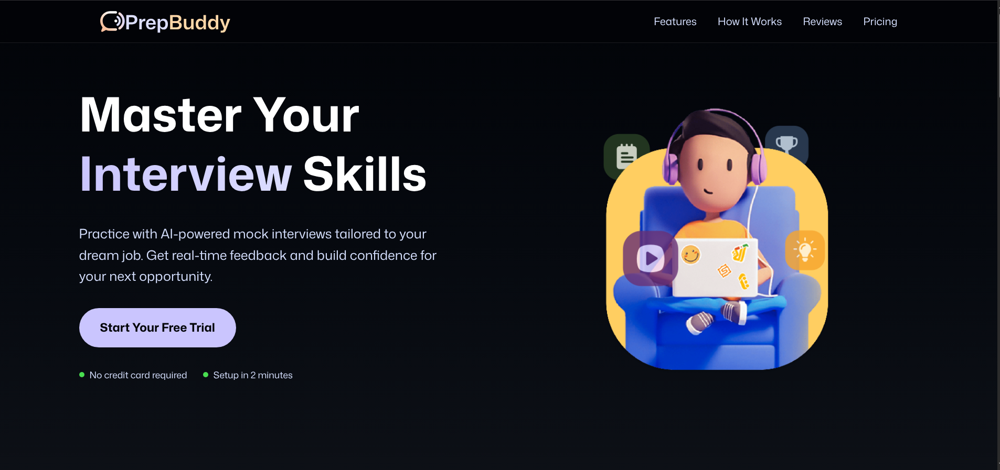
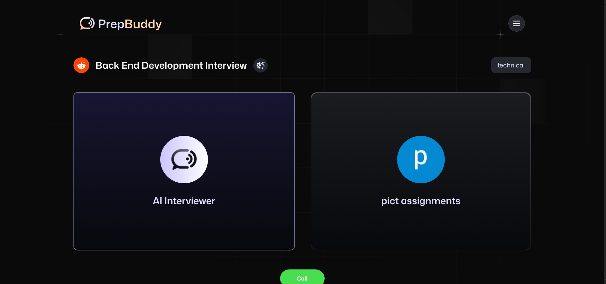
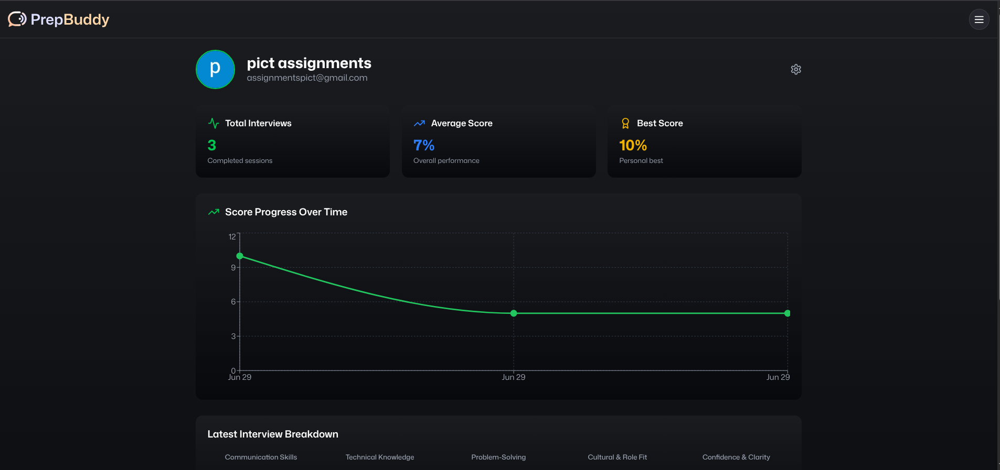

<h1 align="center">🚀 PrepBuddy</h1>

🤠AI-powered Mock Interview Platform with Voice Agents, Real-time Q&A, and Personalized Feedback

  
  
  
  
  

---

## ✨ Features

- 🤖 **AI-generated interview questions** using Google Gemini
- 🗣️ **Voice-based agent interactions** via Vapi
- 🔐 Secure **authentication** with Firebase
- 📊 Real-time **data storage** using Firebase Firestore
- 🎯 Personalized and adaptive **mock interview workflows**
- 🧘 Minimal, responsive UI built with **TailwindCSS**

---

## 🛠️ Tech Stack

| Tech             | Description                                 |
|------------------|---------------------------------------------|
| **Next.js**      | React-based framework for SSR & SPA         |
| **TailwindCSS**  | Utility-first styling framework             |
| **Firebase Auth**| Authentication with Google/email/password   |
| **Firestore**    | Realtime NoSQL database for user data       |
| **Gemini**       | Google's LLM for generating interview Qs    |
| **Vapi**         | Voice agent for conversation-style practice |

---

### 🧩 Architecture Diagram

  

---

## 📸 Preview

